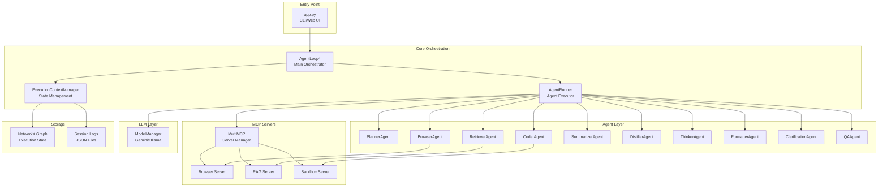
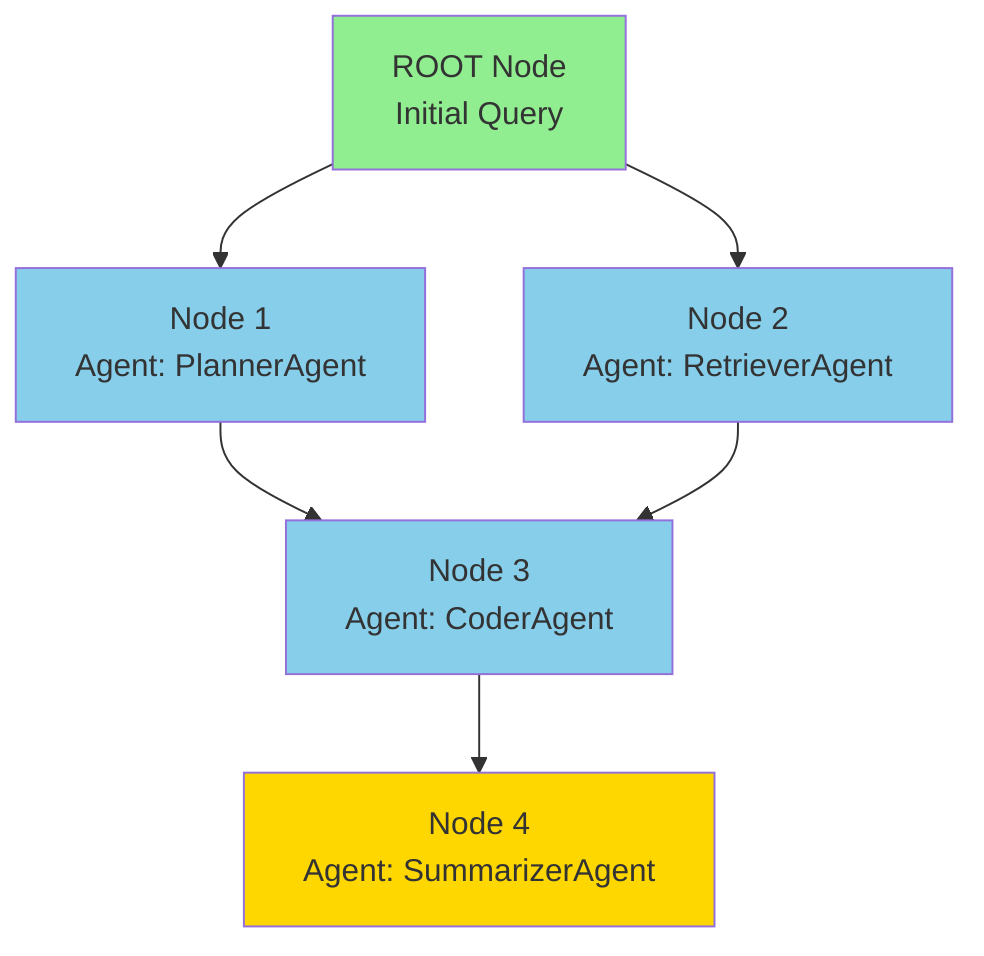
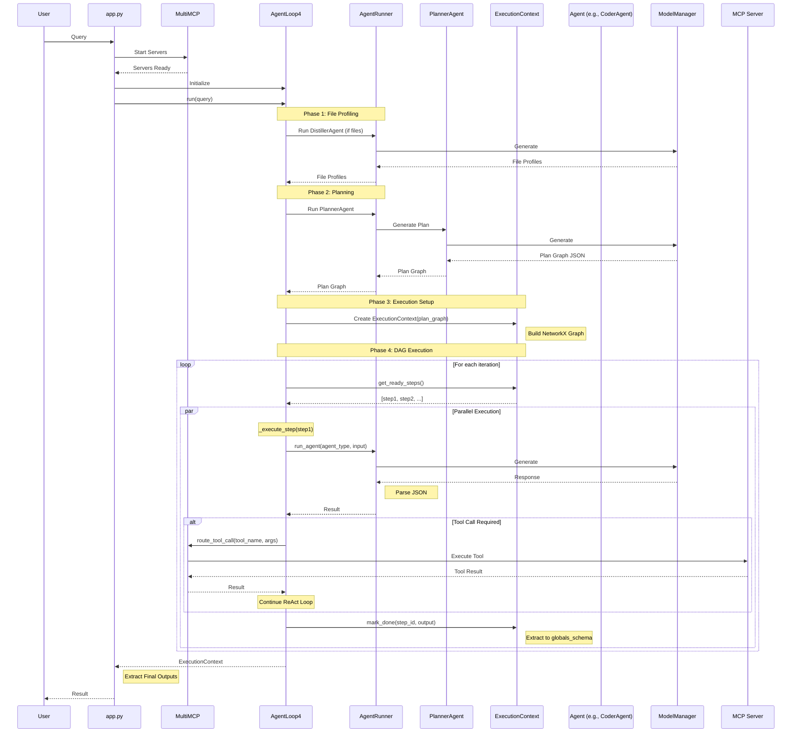
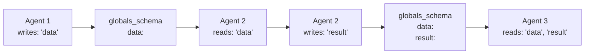
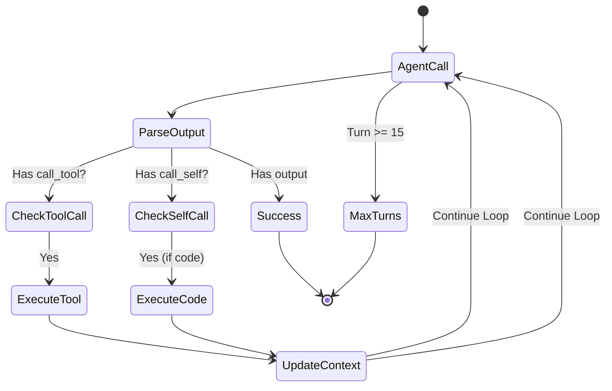
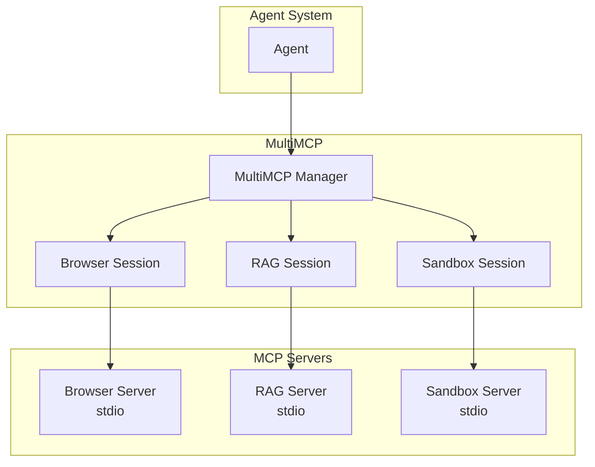
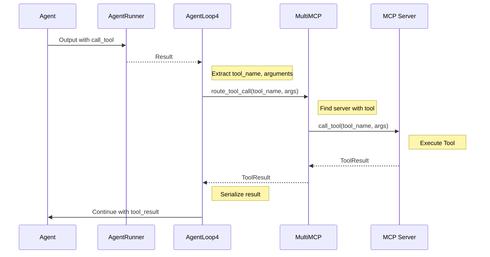
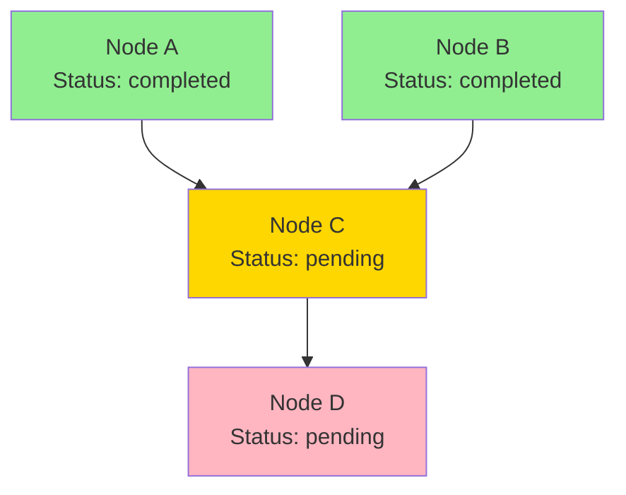

# Architecture Documentation

## Table of Contents
1. [High-Level Overview](#high-level-overview)
2. [System Architecture](#system-architecture)
3. [Core Components](#core-components)
4. [Data Flow](#data-flow)
5. [Agent System](#agent-system)
6. [MCP Integration](#mcp-integration)
7. [Execution Model](#execution-model)
8. [Memory & Context Management](#memory--context-management)
9. [UI & Visualization](#ui--visualization)

---

## High-Level Overview

The S16 NetworkX Agent System is a **graph-based multi-agent orchestration framework** that uses NetworkX directed acyclic graphs (DAGs) to coordinate specialized AI agents. The system processes complex queries by:

1. **Planning**: Breaking down queries into a dependency graph of tasks
2. **Execution**: Running agents in parallel when dependencies allow
3. **Coordination**: Managing data flow between agents via a shared context
4. **Tool Integration**: Providing agents access to external tools via MCP (Model Context Protocol) servers

### Key Design Principles

- **Graph-First Architecture**: All execution state is stored in NetworkX graphs
- **Dependency-Driven Execution**: Agents execute only when dependencies are satisfied
- **ReAct Pattern**: Agents use reasoning-action loops for tool calling
- **Modular Agents**: Each agent is specialized with its own prompt and tool access
- **Async Execution**: Full async/await support for concurrent agent execution

---

## System Architecture

### Architecture Diagram



---

## Core Components

### 1. Application Entry Point (`app.py`)

**Purpose**: Main entry point supporting both CLI and Web UI modes.

**Key Responsibilities**:
- Initialize MCP servers
- Create `AgentLoop4` instance
- Handle user input (CLI or Gradio UI)
- Manage async event loop

**Key Functions**:
- `main()`: Entry point that starts MCP servers and initializes the agent loop
- `run_query()`: Helper function to execute queries and extract results

**Modes**:
- **CLI Mode**: Interactive terminal interface with Rich console
- **Web UI Mode**: Gradio-based chat interface with real-time log streaming

### 2. Agent Loop (`core/loop.py` - `AgentLoop4`)

**Purpose**: Main orchestration engine that manages the execution lifecycle.

**Execution Phases**:

```mermaid
sequenceDiagram
    participant User
    participant Loop as AgentLoop4
    participant Runner as AgentRunner
    participant Planner as PlannerAgent
    participant Context as ExecutionContextManager
    participant Agents as Other Agents
    
    User->>Loop: Query
    Loop->>Runner: Run DistillerAgent (if files)
    Runner-->>Loop: File Profiles
    Loop->>Runner: Run PlannerAgent
    Runner->>Planner: Generate Plan
    Planner-->>Runner: Plan Graph (DAG)
    Runner-->>Loop: Plan Graph
    Loop->>Context: Create ExecutionContext
    Note over Loop: Execute DAG
    loop For each ready step
        Loop->>Agents: Execute Agent
        Agents-->>Loop: Results
        Loop->>Context: Update State
    end
    Loop-->>User: Final Context
```

**Key Methods**:
- `run()`: Main execution method that orchestrates all phases
- `_execute_dag()`: Executes the DAG with visualization and dependency resolution
- `_execute_step()`: Executes a single agent step with ReAct loop support
- `_handle_failures()`: Handles mid-session replanning (TODO)

**ReAct Loop Implementation**:
- Each agent can make up to 15 turns
- Agents can call tools via `call_tool` in their output
- Tool results are fed back to the agent for next iteration
- Agents can use `call_self` for recursive execution

### 3. Agent Runner (`agents/base_agent.py` - `AgentRunner`)

**Purpose**: Executes individual agents by loading prompts, calling LLMs, and parsing responses.

**Agent Execution Flow**:

```mermaid
graph LR
    A[AgentRunner.run_agent] --> B[Load Config]
    B --> C[Load Prompt Template]
    C --> D[Get Tools from MCP]
    D --> E[Build Full Prompt]
    E --> F[Create ModelManager]
    F --> G[Generate LLM Response]
    G --> H[Parse JSON]
    H --> I[Calculate Cost]
    I --> J[Return Result]
```



**Key Responsibilities**:
- Load agent configuration from `agent_config.yaml`
- Load prompt templates from `prompts/` directory
- Retrieve available tools from specified MCP servers
- Build complete prompt with tools and input data
- Call LLM via `ModelManager`
- Parse JSON response using `json_parser`
- Calculate token usage and costs

**Configuration Structure**:
```yaml
AgentName:
  prompt_file: "path/to/prompt.md"
  model: "gemini"  # or "ollama"
  mcp_servers: ["browser", "rag"]  # Tools available to this agent
  description: "Agent description"
```

### 4. Execution Context Manager (`memory/context.py`)

**Purpose**: Manages execution state using NetworkX graphs as the single source of truth.

**Graph Structure**:



**Graph Attributes**:
- `session_id`: Unique session identifier
- `original_query`: User's original query
- `file_manifest`: List of uploaded files
- `created_at`: Timestamp
- `status`: Overall execution status
- `globals_schema`: Shared variable storage (key-value pairs)

**Node Attributes**:
- `agent`: Agent type (e.g., "PlannerAgent")
- `status`: "pending", "running", "completed", "failed"
- `description`: Human-readable task description
- `agent_prompt`: Specific prompt for this step
- `reads`: List of variable names this step reads
- `writes`: List of variable names this step writes
- `output`: Agent output
- `error`: Error message if failed
- `cost`, `input_tokens`, `output_tokens`: Cost tracking
- `start_time`, `end_time`, `execution_time`: Timing data

**Key Methods**:
- `get_ready_steps()`: Returns nodes whose dependencies are complete
- `mark_running()`: Marks a step as running
- `mark_done()`: Marks step complete, extracts outputs to `globals_schema`
- `mark_failed()`: Marks step as failed
- `get_inputs()`: Retrieves input data from `globals_schema` based on `reads`
- `all_done()`: Checks if all steps are complete
- `get_execution_summary()`: Generates summary with costs and outputs

**Data Extraction Logic**:
The `mark_done()` method uses multiple strategies to extract outputs:
1. **Code Execution Results**: Extract from `execution_result.result` (for CoderAgent, RetrieverAgent)
2. **Direct Output**: Extract from agent output dictionary root
3. **Nested Output**: Extract from `output.output[write_key]`
4. **Final Answer Fallback**: Extract from `final_answer` key (SummarizerAgent)

### 5. Model Manager (`core/model_manager.py`)

**Purpose**: Abstracts LLM interactions, supporting multiple providers.

**Supported Models**:
- **Gemini**: Google's Gemini API (with rate limiting ~15 RPM)
- **Ollama**: Local Ollama instances

**Key Features**:
- Async generation with `generate_text()` and `generate_content()`
- Rate limiting for Gemini API
- Image support (Gemini only)
- Model configuration via `config/models.json` and `config/profiles.yaml`

**Rate Limiting**:
- Enforces ~15 requests per minute for Gemini
- Uses asyncio locks to prevent concurrent rate limit violations
- 4.5 second minimum interval between calls

### 6. Multi-MCP Manager (`mcp_servers/multi_mcp.py`)

**Purpose**: Manages multiple MCP (Model Context Protocol) servers and routes tool calls.

**MCP Servers**:
- **Browser Server**: Web browsing and search tools
- **RAG Server**: Document retrieval and search
- **Sandbox Server**: Python code execution

**Key Methods**:
- `start()`: Initializes all configured MCP servers via stdio
- `stop()`: Gracefully shuts down all servers
- `get_tools_from_servers()`: Returns tools from specified servers
- `route_tool_call()`: Routes tool calls to the appropriate server
- `call_tool()`: Executes a tool on a specific server

**Server Configuration**:
```python
server_configs = {
    "browser": {
        "command": "uv",
        "args": ["run", "16_NetworkX/mcp_servers/server_browser.py"],
    },
    "rag": {...},
    "sandbox": {...}
}
```

---

## Data Flow

### Complete Execution Flow



### Variable Flow (globals_schema)



**Key Points**:
- Agents write outputs to `globals_schema` via `writes` keys
- Agents read inputs from `globals_schema` via `reads` keys
- The ExecutionContext automatically extracts outputs after each step
- Multiple extraction strategies ensure robust data flow

---

## Agent System

### Available Agents

| Agent | Purpose | MCP Servers | Model |
|-------|---------|-------------|-------|
| **PlannerAgent** | Generates execution plan DAG | None | Gemini |
| **BrowserAgent** | Web browsing and search | browser | Gemini |
| **CoderAgent** | Python code generation | sandbox, browser, rag | Gemini |
| **RetrieverAgent** | Document/web search | rag, browser | Gemini |
| **SummarizerAgent** | Synthesizes final answers | browser, rag | Gemini |
| **DistillerAgent** | File profiling and summarization | None | Gemini |
| **ThinkerAgent** | Reasoning and logical inference | None | Gemini |
| **FormatterAgent** | Formats final reports | None | Gemini |
| **ClarificationAgent** | User interaction | None | Gemini |
| **QAAgent** | Quality assurance | None | Gemini |

### Agent Execution Pattern

Each agent follows this pattern:

1. **Input Preparation**: AgentRunner builds prompt with:
   - Agent-specific prompt template
   - Available tools (if MCP servers configured)
   - Input data from `globals_schema` (based on `reads`)
   - Session context (query, files, etc.)

2. **LLM Generation**: ModelManager calls LLM with full prompt

3. **Response Parsing**: JSON parser extracts structured output

4. **Output Processing**:
   - If `call_tool` present: Execute tool, continue ReAct loop
   - If `call_self` present: Recursive execution with updated context
   - Otherwise: Extract outputs to `globals_schema`

### ReAct Loop Details



**ReAct Loop Implementation**:
- Maximum 15 turns per agent step
- Tool results are injected as `iteration_context.tool_result`
- Previous output is passed as `previous_output`
- Final turn warning is added to prompt

---

## MCP Integration

### MCP Server Architecture



### Tool Discovery

When an agent is configured with MCP servers:
1. AgentRunner calls `multi_mcp.get_tools_from_servers(server_names)`
2. MultiMCP returns flattened list of tools from those servers
3. Tool descriptions are added to the prompt
4. Agent can call tools via `call_tool` in output

### Tool Execution Flow



---

## Execution Model

### DAG Execution Algorithm

```python
while not context.all_done() and iteration < max_iterations:
    # 1. Get ready steps (dependencies satisfied)
    ready_steps = context.get_ready_steps()
    
    if not ready_steps:
        # Check for failures or wait
        continue
    
    # 2. Mark as running
    for step_id in ready_steps:
        context.mark_running(step_id)
    
    # 3. Execute in parallel
    tasks = [execute_step(step_id, context) for step_id in ready_steps]
    results = await asyncio.gather(*tasks)
    
    # 4. Process results
    for step_id, result in zip(ready_steps, results):
        if result["success"]:
            await context.mark_done(step_id, result["output"])
        else:
            context.mark_failed(step_id, result["error"])
```

### Dependency Resolution



**Rules**:
- A node is "ready" when ALL predecessors have status "completed"
- Multiple nodes can execute in parallel if dependencies allow
- Failed nodes stop execution (unless replanning is implemented)

### Parallel Execution

The system supports true parallel execution:
- Multiple agents can run simultaneously via `asyncio.gather()`
- Each agent step is independent once dependencies are satisfied
- Tool calls within agents are async and non-blocking

---

## Memory & Context Management

### Session Persistence

**Storage Location**: `memory/session_summaries_index/YYYY/MM/DD/session_{session_id}.json`

**Storage Format**: NetworkX `node_link_data` format (JSON)

**Auto-Save**: After each step completion or failure

**Session Data Includes**:
- Complete graph structure (nodes, edges)
- All node attributes (outputs, costs, timing)
- Graph attributes (query, file_manifest, globals_schema)
- Execution history

### Debug Logs

**Location**: `memory/debug_logs/`

**Files**:
- `latest_prompt.txt`: Most recent agent prompt
- `{timestamp}_{agent}_prompt.txt`: Historical prompts
- `{timestamp}_{agent}_response.txt`: Historical responses

### Context Graph Structure

```python
plan_graph = nx.DiGraph()

# Graph-level attributes
plan_graph.graph = {
    'session_id': '12345678',
    'original_query': 'User query',
    'file_manifest': [...],
    'created_at': '2025-01-15T10:30:00',
    'status': 'running',
    'globals_schema': {
        'data': {...},
        'result': {...}
    }
}

# Node attributes
plan_graph.nodes['step1'] = {
    'agent': 'PlannerAgent',
    'status': 'completed',
    'reads': [],
    'writes': ['plan_graph'],
    'output': {...},
    'cost': 0.001,
    ...
}
```

---

## UI & Visualization

### Execution Visualizer (`ui/visualizer.py`)

**Purpose**: Real-time visualization of DAG execution state.

**Features**:
- Tree view of execution DAG
- Status indicators (pending, running, completed, failed)
- Execution log panel
- Convergence node handling (multiple parents)

**Visualization Layout**:
```
┌─────────────────────────────────────┐
│   Agent Execution DAG               │
│                                     │
│   ROOT ✅ Initial Query             │
│   ├── step1 ✅ PlannerAgent         │
│   │   ├── step2 ✅ RetrieverAgent   │
│   │   └── step3 🔄 CoderAgent       │
│   └── step4 ⏳ SummarizerAgent      │
└─────────────────────────────────────┘
┌─────────────────────────────────────┐
│   Execution Log                     │
│   [10:30:15] 🔄 Starting step3...  │
│   [10:30:20] ✅ Completed step2     │
└─────────────────────────────────────┘
```

### Web UI (Gradio)

**Features**:
- Chat interface
- Real-time log streaming
- Execution summary display
- Non-blocking async execution

**Implementation**:
- Uses Gradio's `ChatInterface`
- Monkey-patches logging to capture logs
- Streams logs while execution runs
- Displays final result with execution logs

---

## Low-Level Implementation Details

### JSON Parsing (`core/json_parser.py`)

**Purpose**: Robustly parse JSON from LLM outputs (which may be malformed).

**Strategies**:
1. **Fenced JSON**: Extract from ` ```json ... ``` ` blocks
2. **Balanced Braces**: Find largest balanced `{...}` block
3. **Auto-Repair**: Use `json_repair` library to fix common issues

**Error Handling**:
- Raises `JsonParsingError` if all strategies fail
- Supports required key validation

### Code Execution (`tools/sandbox.py`)

**Purpose**: Execute Python code generated by agents safely.

**Features**:
- Variable injection from `globals_schema`
- MCP tool access within code
- Error handling and result capture
- Execution time tracking

**Variable Injection**:
```python
# Injected automatically:
globals_schema variables → global variables
reads_data → convenience dict
agent output variables → global variables
```

### Cost Calculation

**Formula**:
```
input_tokens = words * 1.5
output_tokens = words * 1.5
input_cost = (input_tokens / 1_000_000) * $0.1
output_cost = (output_tokens / 1_000_000) * $0.4
total_cost = input_cost + output_cost
```

**Tracking**:
- Per-agent cost tracking
- Session-level cost aggregation
- Cost breakdown in execution summary

### Error Handling

**Failure Modes**:
1. **Agent Failure**: Step marked as "failed", execution continues if possible
2. **Tool Failure**: Error fed back to agent for retry
3. **JSON Parse Failure**: Raises exception, step fails
4. **Code Execution Failure**: Tries next code variant if available

**Recovery**:
- Mid-session replanning (TODO: not yet implemented)
- Tool retry via ReAct loop
- Code variant fallback

---

## Configuration Files

### `config/agent_config.yaml`
Defines all agents, their prompts, models, and tool access.

### `config/mcp_server_config.yaml`
Defines MCP server configurations (currently legacy, servers are hardcoded in `multi_mcp.py`).

### `config/models.json`
Defines LLM model configurations (API keys, endpoints, types).

### `config/profiles.yaml`
Defines default model profiles and settings.

---

## Extension Points

### Adding a New Agent

1. Create prompt file in `prompts/new_agent.md`
2. Add agent config to `config/agent_config.yaml`:
   ```yaml
   NewAgent:
     prompt_file: "16_NetworkX/prompts/new_agent.md"
     model: "gemini"
     mcp_servers: ["browser"]  # Optional
     description: "Agent description"
   ```
3. Agent is automatically available to PlannerAgent

### Adding a New MCP Server

1. Create server script in `mcp_servers/server_new.py`
2. Add to `MultiMCP.server_configs`:
   ```python
   "new_server": {
       "command": "uv",
       "args": ["run", "16_NetworkX/mcp_servers/server_new.py"],
   }
   ```
3. Reference in agent configs via `mcp_servers: ["new_server"]`

### Adding a New LLM Provider

1. Add model config to `config/models.json`
2. Implement generation method in `ModelManager`:
   ```python
   async def _new_provider_generate(self, prompt: str) -> str:
       # Implementation
   ```
3. Add case in `generate_text()` method

---

## Performance Considerations

### Parallelization
- Agents execute in parallel when dependencies allow
- Tool calls are async and non-blocking
- MCP servers run in separate processes

### Rate Limiting
- Gemini API: ~15 RPM (4.5s minimum interval)
- Enforced via asyncio locks
- Prevents API quota exhaustion

### Memory Management
- NetworkX graphs are memory-efficient for DAGs
- Session data persisted to disk after each step
- Debug logs can be cleaned periodically

### Scalability
- Graph-based execution scales to large DAGs
- Parallel execution improves throughput
- MCP servers can be distributed

---

## Future Enhancements

1. **Mid-Session Replanning**: Implement `_handle_failures()` for dynamic replanning
2. **Agent Memory**: Long-term memory for agents across sessions
3. **Streaming Responses**: Real-time streaming of agent outputs
4. **Distributed Execution**: Execute agents across multiple machines
5. **Advanced Visualization**: Interactive graph visualization in web UI
6. **Cost Optimization**: Agent selection based on cost/performance tradeoffs

---

## Conclusion

The S16 NetworkX Agent System provides a robust, scalable framework for multi-agent orchestration. Its graph-based architecture enables complex workflows while maintaining clarity and debuggability. The modular design allows easy extension with new agents, tools, and LLM providers.
